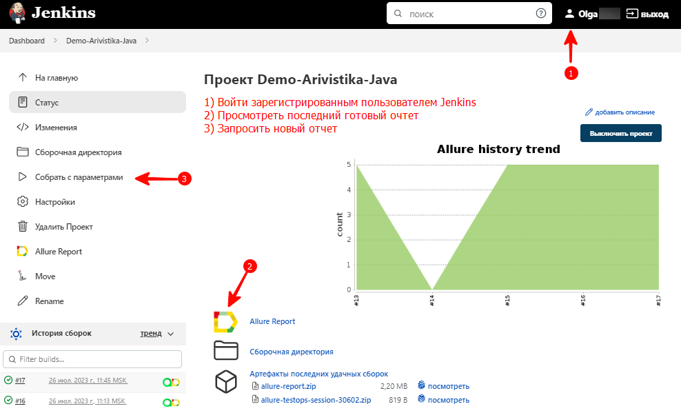
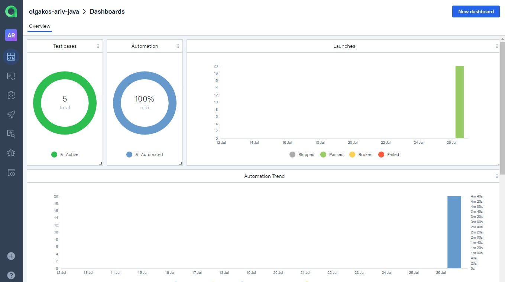
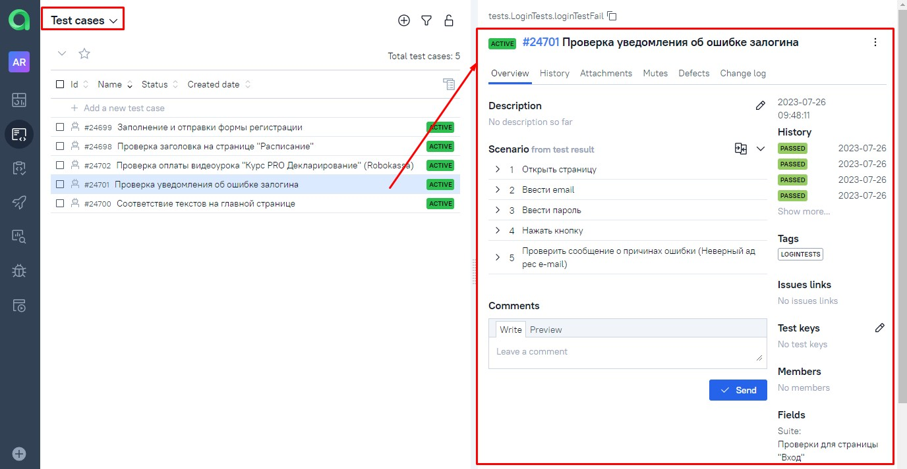

# Arivistika


## Site:
https://arivistika.ru/ (продажа курсов ВЭД)

## Description:
В этом репозитории:
- Демо-проект с <b>автотестами</b> на <b>Java</b>.
- Настроен запуск тестов "одной кнопкой" с любого компьютера со стабильным интернетом. Установка ПО не требуется.
- Визуальный отчет о прохождении тестов. Отчет может сформировать любой сотрудник: оценить тестовое покрытие и/или  передать разработчикам информацию о проблеме.
- После выполнения каждого теста записывается видео и скриншот экрана.
- Уведомление о результатах тестов в <b>Telegramm</b> группу.

## Stack:
<p align="center">
<a href="https://www.jetbrains.com/idea/"></a>
<a href="https://www.java.com/"></a>
<a href="https://github.com/"></a>
<a href="https://junit.org/junit5/"></a>
<a href="https://gradle.org/"></a>
<a href="https://selenide.org/"></a>
<a href="https://aerokube.com/selenoid/"></a>
<a href="https://github.com/allure-framework/allure2"></a>
<a href="https://www.jenkins.io/"></a>
<a href="https://docs.qameta.io/allure-testops/"></a>
<a href="https://www.atlassian.com/ru/software/jira"></a>     
<a href="https://web.telegram.org/"></a>
</p>

- Язык: `Java`
- Сборщик проекта: `Gradle`
- Для написания UI-тестов используется фреймворк `Selenide`, современная «обёртка» вокруг `Selenium WebDriver`
- Библиотека модульного тестирования: `JUnit 5`
- `Jenkins` выполняет удаленный запуск тестов в графическом интерфейсе. Установки дополнительных приложений на компьютер пользователя не требуется.
- `Selenoid` запускает браузер с тестами в контейнерах `Docker` (и записывает видео)
- Фреймворк `Allure Report` собирает графический отчет о прохождении тестов
- Добавлен пример интеграции с `AllureTestOps`: (коммерческим) сервисом  удаленного запуска и сортировки автотестов. AllureTestOps это Allure Report c расширенным функционалом
- После завершения тестов `Telegram Bot` отправляет в `Telegram` краткий вариант Allure Report

## Tests:
- [x] "Проверка уведомления об ошибке залогина"
- [x] "Проверка соответствия текстов на главной странице сайта"
- [x] "Заполнение формы регистрации.
- [x] "Проверка заголовка на странице "Расписание"
- [x] "Проверка оплаты видеоурока "Курс PRO Декларирование" (Robokassa)

## Как запустить тесты:
### Вариант 1. Локальный запуск
<details>
   <summary>Краткая инструкция</summary>
   
1. Скачать проект и открыть в IntelliJ IDEA
2. Запустить тесты из терминала
   <br><b>note:</b> это команды для Windows
```
gradle clean test
```
3. Выполнить запрос на формирование отчета:
```
gradle allureReport
```
4. Открыть отчет в браузере:
```
gradle allureServe
```
<p>Результат: откроется страница с отчетом Allure Report
</details>

### Вариант 2. Удаленный запуск тестов (в Jenkins)
<details>
   <summary>Краткая инструкция</summary>
   
1. <i>Зарегистрированным</i>* пользователем перейти** на страницу сборки проекта по ссылке: <b><a target="_blank" href="https://jenkins.autotests.cloud/job/Demo-Arivistika-Java/">Jenkins</a></b>
2. Выбрать желаемые "параметры сборки" в графическом интерфейсе или оставить как есть.
3. Запустить выполнение тестов кнопкой "Собрать..."
4. Убедиться, что в блоке История сборок появилась новая запись.
5. Дождаться окончания активного процесса (~1 мин)
6. Кликнуть по значку или тексту Allure Report
<p>Результат: откроется страница с отчетом Allure Report</p>

> *Незарегистрированным пользователем можно открывать только готовый, ранее сформированный отчет (стрелка №2 на скриншоте)
><br> **NB! Срок хранения сборки на сервере ~60 дней. Ссылка может оказаться недоступной после 26.09.2023


</details>

## Пример Allure отчета:
<details>
   <summary>Скриншоты с комментариями</summary>
   
###### Главный экран (Owerwiev)

###### Страница со списком тестов (Suites)

###### Пример описания пройденного  теста

###### Пример описания упавшего теста

</details>

## Пример видео прохождения тестов:
Видеозапись каждого теста генерируется с помощью `Selenoid` после успешного запуска контейнера c тестами в `Docker`.
<br>


## Пример интеграции тестов в сервис AllureTestOps:
<details>
   <summary>Скриншоты с комментариями</summary>
<br>  
<i>Зарегистрированным</i> пользователем перейти на страницу проекта по ссылке: <b><a target="_blank" href="https://allure.autotests.cloud/project/3565/dashboards">AllureTestOps Project</a></b>. Или см. скриншоты ниже:  
   
###### Главный экран (Owerwiev)
   
###### Страница со списком тестов (Test cases)

</details>

------------
##### todo
## Jira
## Отчет в Telegram
После завершения сборки специальный Telegram-бот отправляет сообщение с отчетом.
Чтобы видеть его увидеть, вступите (временно) в группу `OlgaKos Bot_Group`

------------
ver 2023-07-27 home1
