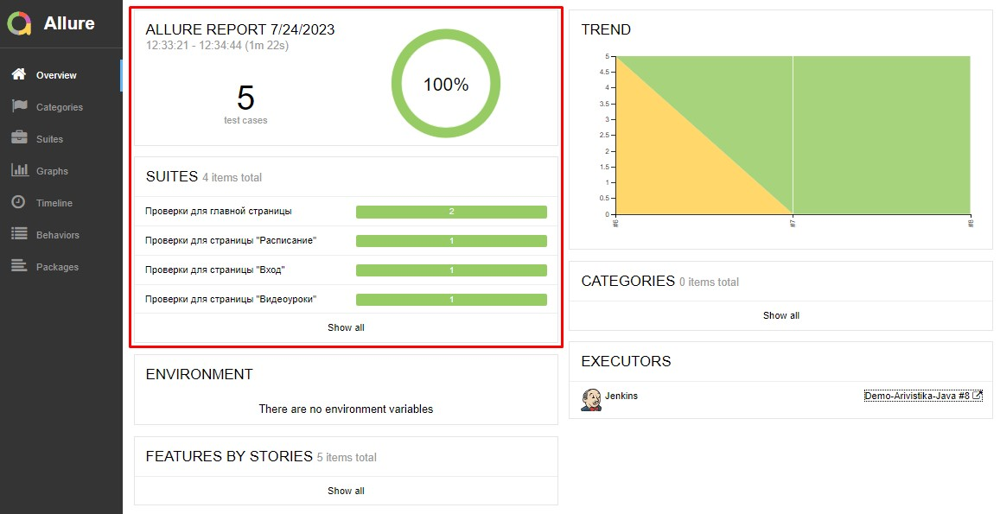

# Arivistika


## Site:
https://arivistika.ru/ (продажа курсов ВЭД)

## Description:
В этом репозитории:
- проект с <b>автотестами</b> на <b>Java</b>
- Настроен запуска тестов "одной кнопкой" с любого компьютера со стабильным интернетом. Установка ПО не требуется.
- Добавлен визуальный отчет о прохождении тестов. Отчет может сформировать любой сотрудник, без специальных знаний точно локализовать проблему и передать информацию разработчикам.
- После выполнения каждого теста делается скриншот экрана и записывается видео 
- ~~Уведомление о результатах тестов поступают в Telegramm (в работе)~~

## Stack:
<p align="center">
<a href="https://www.jetbrains.com/idea/"></a>
<a href="https://www.java.com/"></a>
<a href="https://github.com/"></a>
<a href="https://junit.org/junit5/"></a>
<a href="https://gradle.org/"></a>
<a href="https://selenide.org/"></a>
<a href="https://aerokube.com/selenoid/"></a>
<a href="https://github.com/allure-framework/allure2"></a>
<a href="https://www.jenkins.io/"></a>
<a href="https://web.telegram.org/"></a>
</p>

- Язык: `Java`
- Сборщик проекта: `Gradle`
- Для написания UI-тестов используется фреймворк `Selenide`, совремнная «обёртка» вокруг `Selenium WebDriver`
- Библиотека модульного тестирования: `JUnit 5`
- `Jenkins` выполняет удаленный запуск тестов в графическом интерфейсе. Установки дополнительных приложений на компьютер пользователя не требуется.
- `Selenoid` запускает браузер с тестами в контейнерах `Docker` (и записывает видео)
- Фреймворк`Allure Report` собирает графический отчет о прохождении тестов
- ~~После завершения тестов `Telegram Bot` отправляет в `Telegram` краткий вариант Allure Report~~

## Tests:
- [x] "Проверка уведомления об ошибке залогина"
- [x] "Проверка соответствия текстов на главной странице сайта"
- [x] "Заполнение формы регистрации.
- [x] "Проверка заголовка на странице "Расписание"
- [x] "Проверка оплаты видеоурока "Курс PRO Декларирование" (Robokassa)

## Как запустить тесты:
###### Вариант 1. Локальный запуск 
1. Скачать проект и открыть в IntelliJ IDEA
2. Запустить тесты командой из терминала: 
```
gradle clean test
```
3. Выполнить запрос на формирование отчета командой из терминала:
```
gradle allureReport
```
4. Открыть отчет в браузере командой из терминала:
```
gradle allureServe
```
Результат: откроется страница с отчетом Allure Report

###### Вариант 2. Удаленный запуск тестов (в Jenkins)
1. <i>Зарегистрированным</i> пользователем перейти(*) на страницу сборки проекта по ссылке: <a target="_blank" href="https://jenkins.autotests.cloud/job/Demo-Arivistika-Java/">Jenkins</a> 
2. Выбрать желаемые "параметры сборки" в графическом интерфейсе или оставить как есть.
3. Запустить выполнение тестов кнопкой "Собрать" (внизу страницы)
4. Убедиться, что в блоке История сборок (напротив номера #) появился желтый значок Allure Report. (Если сборка запущена, но значок не виден, убедиться, что меню "История сброк" раскрыто)
5. Кликнуть по значку Allure Report
<br>Результат: откроется страница с отчетом Allure Report


(*) NB! Сейчас срок хранения сборки на сервере ~60 дней. Ссылка для удаленного демо-запуска может оказаться недоступной после 20.09.2023 :( 

## Пример отчета

###### Главный экран (Owerwiev)


###### Страница со списком тестов (Suites)

  
###### Пример описания пройденного  теста :)


###### Пример описания упавшего теста :(


## Видео тестов
Видеозапись каждого теста генерируется с помощью `Selenoid`, после успешного запуска контейнера c тестами в `Docker`. 

<br>Образец:


## Отчет в Telegram
###### todo
После завершения сборки специальный Telegram-бот отправляет сообщение с отчетом.
Чтобы видеть его увидеть, вступите (временно) группу `OlgaKos Bot_Group`


------------
ver 2023-07-20